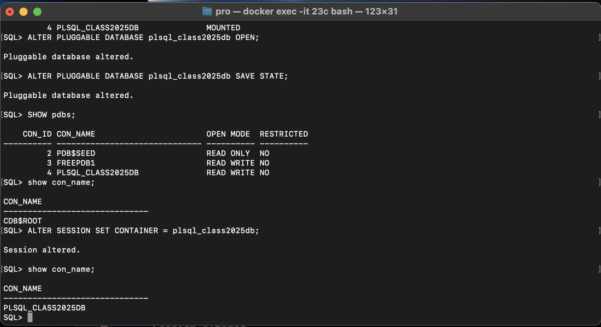

# plsql-pdb-bikorimana-eric

##### Student ID: 27928

##### Names: Eric  BIKORIMANA

## Introduction

This assignment focuses on creating and managing Oracle Pluggable Databases (PDB) and configuring Oracle Enterprise Manager (OEM). I practice essential database administration tasks including PDB creation, deletion, and monitoring.

### TASK 1: Create a New Pluggable Database (PDB)

 
The code for create plsql_class2025db PDB is [here.](sql/01_plsql_class2025db.sql)

* Step-by-step (By using SQL*Pus)

* Connect as System database admin `sqlplus / as sysdba` and Create a new pluggable database

* Check if created, Open the New PDB and check open mode status

* Enter to plsql_class2025db PDB

### TASK 2: Create and Delete a PDB

The code for create er_to_delete_pdb_27928 PDB is [here.](sql/02_er_to_delete_pdb.sql)

* Create a New Pluggable Database(PDB) called er_to_delete_pdb_27928

* Check if created, Open the New PDB and drop or delete it.

### TASK 3: Configure Oracle Enterprise Manager (OEM)

The code for Configure OEM is [here.](sql/03_configure_oem.sql)

* Check the HTTP and HTTPS port

* Set the HTTP PORT to 8080 and HTTPS PORT to 8800

* Check the Oracle Listener Status

* Restart the Oracle Database and start up again

Access OEM in your browser URL format: [https://localhost:8800](https://localhost:8800)

#### Challenge:

For me there is issues for not connect the OEM in browser and i put my username and password for my oracle

